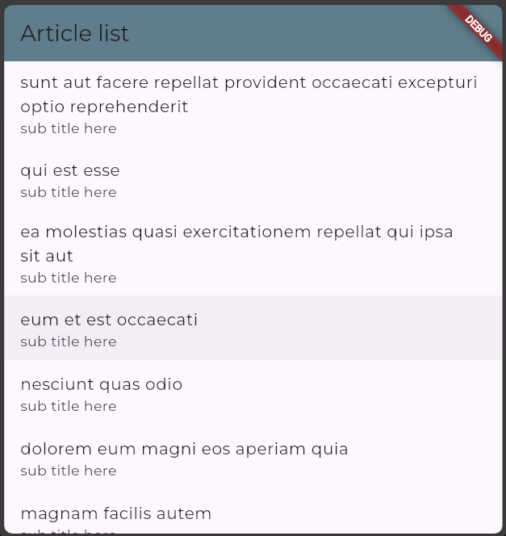
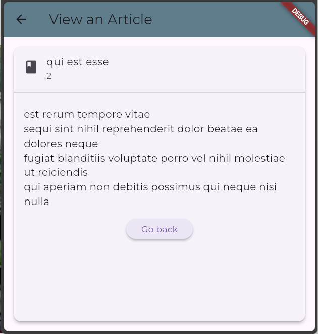

# Articles list and view

A multi page Flutter app showing API consumption and state management.:

- Uses free API to fetch data and display as a list
- When you click on one article topic it takes you to a detail display page
- API guide: [https://jsonplaceholder.typicode.com/guide](https://jsonplaceholder.typicode.com/guide)
- API end point: [https://jsonplaceholder.typicode.com/posts](https://jsonplaceholder.typicode.com/posts)
- Data object is used along with a factory to create a list of articles (see: `/lib/models/article.dart`)
- `main.dart` calls `/lib/screens/list_article.dart` (the homepage)
- `/lib/controllers/article_controller.dart` fetches the data with a Future ansyc/await system
- Uses [GetX](https://pub.dev/packages/get) for state management 
- Refer the pubspec.yaml for other dependencies (ie: [http](https://pub.dev/packages/http), [get](https://pub.dev/packages/get), [google_fonts](https://pub.dev/packages/google_fonts))
 - You may generate Dart documentation by typing `dart doc` within the console and observe the `\doc\api\index.html` file for more information.

## Folder structure
- `\lib\controllers` GetX controller files.
- `\lib\models` Model (or data object) files.
- `\lib\screens` UI screens (or route) files.

## Article model 
Also known as data object or schema.

'userId' is ignored.
```
[
    {
        "userId": 1,
        "id": 1,
        "title": "sunt aut facere",
        "body": "quia et suscipit architecto"
    },
    {
        "userId": 1,
        "id": 2,
        "title": "qui est esse",
        "body": "est rerum tempore nulla"
    },
]
```
## Sample screens
#### Article list screen. Click on a title to goto next screen.


#### Article view screen. Click 'Go back' button to go to 'Article List' screen
